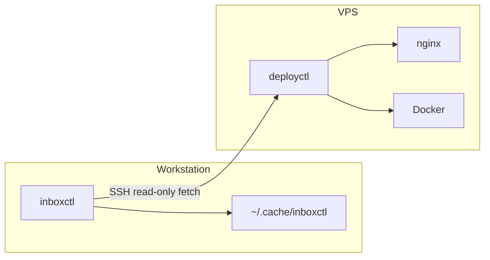
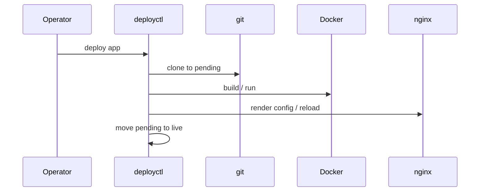
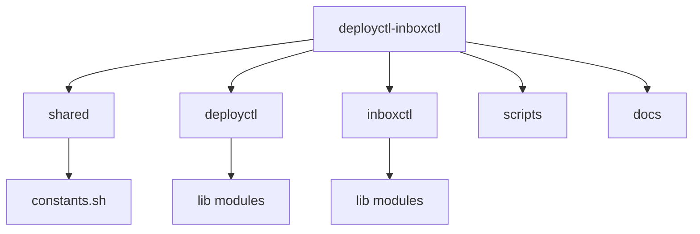

<!--
Project: deployctl-inboxctl
SPDX-License-Identifier: MIT
Maintainer: YOUR_NAME <YOUR_EMAIL>
Repository: https://github.com/YOUR_ORG/YOUR_REPO
Copyright: (c) YOUR_NAME_OR_ORG - see LICENSE
-->
# Architecture

## Global architecture



## Deploy lifecycle



## inboxctl fetch flow

```mermaid
flowchart TD
  A[inboxctl fetch server] --> B[SSH / scp read-only]
  B --> C[/etc/deployctl/projects.d]
  B --> D[/var/log/deployctl/history.log]
  B --> E[/var/log/deployctl/projects/*.log]
  B --> F[/var/lib/deployctl/state optional]
  C --> G[~/.cache/inboxctl/servers/name]
  D --> G
  E --> G
  F --> G
```

## Repository folder structure



Secrets never live in repository-tracked `.conf` samples — only on-server `/var/lib/deployctl/env/*.env`.
